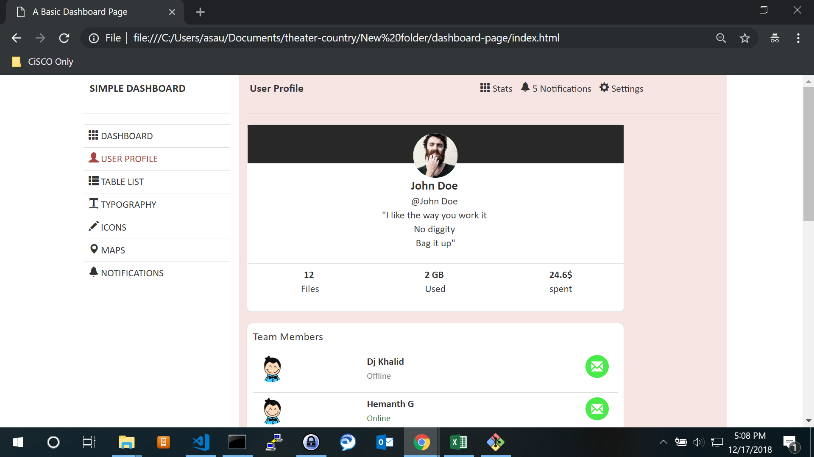

# dashboard-page
A simple Dashboard home page using `HTML5`, `CSS3` and `Bootstrap 3`.

This page is only an demonstration of an Dashboard page UI. For that reason it is a static page.

## Installation

1. Clone the repository using `git clone https://github.com/anijitsahu/dashboard-page.git` from Git Bash / Command Prompt
2. Navigate inside the directory `dashboard-page`
3. Open `index.html` to see the dashboard page
 
*tested with Google Chrome v70 and Mozilla Firefox Developer Editon*  

## Screenshots

