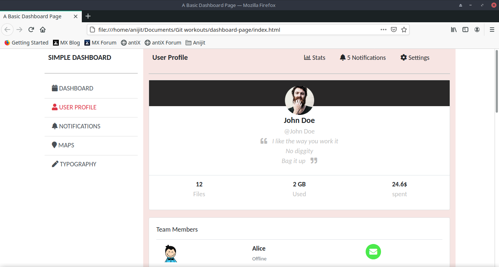

# dashboard-page
A simple Dashboard home page using [HTML5](https://www.w3schools.com/html/html5_intro.asp), [CSS3](https://www.w3schools.com/css/) and [Bootstrap 4](https://getbootstrap.com/docs/4.5/getting-started/).

This page is only an demonstration of an Dashboard page UI. For that reason it is a static page.

## Features
- It is created using  [HTML5](https://www.w3schools.com/html/html5_intro.asp), [CSS3](https://www.w3schools.com/css/) and [Bootstrap 4](https://getbootstrap.com/docs/4.5/getting-started/).
- Code is rewritten using [Bootstrap 4](https://getbootstrap.com/docs/4.5/getting-started/).
- [Font Awesome](https://fontawesome.com/icons?d=gallery&p=2&m=free) icons are used

## Installation

Clone the repository and navigate to it:
```  
git clone https://github.com/anijitsahu/dashboard-page.git
cd dashboard-page
```
Open `index.html` with any web browser to see the dashboard page
 
*tested with Google Chrome v70 and Mozilla Firefox Developer Editon*  

## Screenshots


